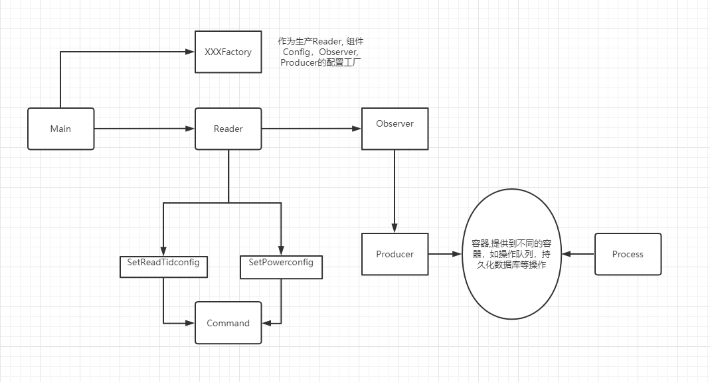

# 读写器模块

> 2021-02-01 v1.0 文档初稿
> 2021-04-08 新增项目结构注释

+ 该模块主要维护：
    * 读写器管理模块，包括维护连接对象(检测心跳，断线重连)，对读写器做某些特定配置(如设置观察者和功率等)
    * 读写器业务模块，用户可根据不同的业务场景，对标签数据进行分析
    

#### 1. 项目结构 
  
1. common 主要包括注解，读写器通用实体，枚举类等  
2. third 主要包含第三方SDK  
3. module 读写器模块
    1. client 客户端，服务启动器
    2. process 定义业务处理的process
    3. producer 定义标签的生产者。不同业务可提供不同生产方式，如存储到mq队列，持久化等。
    4. reader 定义读写器连接管理，其中包括通用读写器连接管理封装。核心业务
        1. base 定义读写器连接池和检测心跳等操作
        2. command 提供通用的读写器命令接口，让不同读写器的sdk进行适配
        3. config 读写器功能配置(如设置功率等操作)，对读写器进行配置，为support的实例进行服务
        4. container 定义通用的读写器管理容器，提供给检测心跳用
        5. factory 舍弃
        6. observer 读写器的回调，标签生产的地方。不同的读写器有不同的SDK回调，所以此模块没有通用的接口。其它读写器可参考RxtxBaseObsever进行接入
        7. reflection 读写器Bean管理， 其中主要包括ProducerFactory, readerProcess, readerClass，提供给client使用
        8. service 提供读写器管理状态持久化接口，用户自定义实现
        9. support 不同读写器管理对象实现。 不同读写器通过继承AbstractReader来适配不同读写器SDK，而相同读写器扩展功能时，可使用包装模式或继承拓展来实现。

#### 2. 如何编写特定业务(针对罗丹贝尔读写器)
整体流程

##### 2.1 定义Reader 
1. Reader读写器管理对象(业务实体)  
主要维护业务数据：
    1. 不同sdk的读写器对象； 
    2. 设备记录；
    3. 心跳时间；
    4. 执行命令队列等。  
并提供关键业务功能：
    1. 设置观察者到读写器对象上； 
    2. 设置功率； 
    3. 提供一套特定读写器的启动方法(让用户自定义)。
2. 用法: 通过继承AbstractReader，实现抽象方法，得到不同读写器的管理对象，Reader对象需要添加注解@Reader, 来标识不同品牌不同类型。 模块中已实现对罗丹贝尔读写器的读写器对象RxtxReader。  
3. 拓展读写器模块。 对于场景需要开启读写器某功能，建议通过使用包装器Wrapper(参考： **RxtxWrapperReader**)。 并通过Config配置的方法(参考：**2.2**)，对读写器功能进行拓展。 

##### 2.2 定义Config
(1) Config需要做的两件事为： 1. 维护底层api命令Command。 2. 并将Command加进执行命令队列中  
(2) 针对不同的功能，实现不同的Config配置。 通过在reader中配置所需的Config，得到更灵活的配置。

##### 2.3 Command
(1) 通过对底层的api命令的封装，防止在多处直接使用原生sdk的api，方便管理和维护。  
(2) 针对不同的功能，将真正执行特定读写器功能的命令转移到Command中。   
(3) 用法： 通过继承BaseReaderCommand实现不同读写器的命令，主要维护AbstractReader的管理对象和执行指令的参数类型。参考： *RxtxFastSwitchCommand*  
(4) 缺点： 如果使用到命令过多，则可能会造成类爆炸。

##### 2.4 Observer
(1) 由于不同sdk的观察者Observer没有统一的父类。 所以需要通过继承不同父类的Observer，来添加额外的信息，如Reader管理对象和Producer标签数据生产者。 参考: *RxtxBaseObserver*  
(2) 其中不同的Producer负责分发读写器回调的数据TagMsg。 

##### 2.5 Producer
(1) 将读写器管理与Process业务开发解耦(两者都依赖容器)。 
(2) 用户根据标签的业务场景不同，将标签数据TagMsg放到不同的容器中(如系统队列，mq队列，持久化数据库等)。 默认提供系统队列的生产者实现(参考: *SqProducer*)。  
(3) 用法： 通过继承ReaderProducer, 实现特定业务下各种生产方式的生产者。 用户需提供特定业务场景的ProducerFactory, 该类需要实现@Producer注解，来标识是属于哪个业务的生产者工厂。

##### 2.6 Process(建议)
该process模块和producer模块解耦。两者都依赖于队列等容器。由于与标签生产解耦，所以标签业务处理可自定义，只需到特定容器去获取即可。  
专家建议通过继承ReaderProcess, 实现特定业务处理，而不同生产方式的数据获取，可通过委托方式，交给特定的Process来处理。

##### 2.7 心跳管理机制
读写器管理模块有单独线程来检测读写器是否处于正常连接状态。 目前的做法是在发送指令的同时，保存当前最新的心跳时间。 用户还需要维护好Reader管理对象的判断存活方法isAlive()。

#### 3. 如何对接其它读写器
参考**步骤2的流程**，主要实现**2.1-2.4**部分
